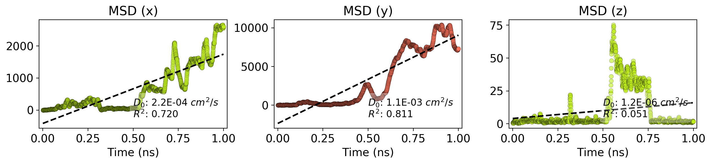

test
=======

MSD Trajectory
--------------

LAMMPS MSD vs time
------------------

Angstrom MSD vs time
------------------

### Simulation details

-   Simulation directory: /ihome/cwilmer/kbs37/Nanocar/scripts
-   Report date: 2018-03-01 11:28

#### Simulation files

<table>
  <tr>
    <th>File</th>
    <th>Date</th>
    <th>Size</th>
  </tr>
  <tr>
    <td>traj.xyz</td>
    <td>2018-02-28 11:05</td>
    <td>964.2 kB</td>
  </tr>
  <tr>
    <td>__pycache__</td>
    <td>2018-03-01 11:26</td>
    <td>0.0 kB</td>
  </tr>
  <tr>
    <td>kutmatik-token</td>
    <td>2018-02-28 11:05</td>
    <td>0.0 kB</td>
  </tr>
  <tr>
    <td>pygithub-example.py</td>
    <td>2018-02-28 11:05</td>
    <td>1.3 kB</td>
  </tr>
  <tr>
    <td>sim_report.py</td>
    <td>2018-03-01 11:25</td>
    <td>2.4 kB</td>
  </tr>
  <tr>
    <td>vis-state.vmd</td>
    <td>2018-02-28 11:05</td>
    <td>4.5 kB</td>
  </tr>
  <tr>
    <td>msdtools.py~</td>
    <td>2018-02-28 11:05</td>
    <td>8.3 kB</td>
  </tr>
  <tr>
    <td>msd1.csv</td>
    <td>2018-02-28 11:05</td>
    <td>185.7 kB</td>
  </tr>
  <tr>
    <td>sim_report.py~</td>
    <td>2018-02-28 17:36</td>
    <td>2.0 kB</td>
  </tr>
  <tr>
    <td>msdtools.py</td>
    <td>2018-03-01 11:11</td>
    <td>8.6 kB</td>
  </tr>
</table>

