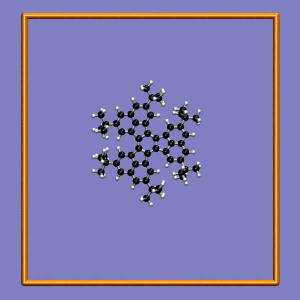
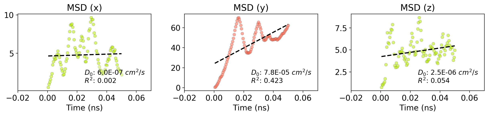
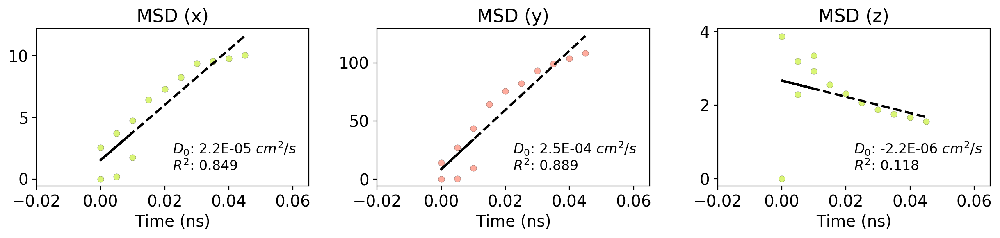

test
=======

MSD Trajectory
--------------

LAMMPS MSD vs time
------------------

Angstrom MSD vs time
------------------

### Simulation details

-   Simulation directory: /ihome/cwilmer/kbs37/Nanocar/HtBDC_Cu110/test
-   Report date: 2018-03-02 09:57

#### Simulation files

<table>
  <tr>
    <th>File</th>
    <th>Date</th>
    <th>Size</th>
  </tr>
  <tr>
    <td>HtBDC_Cu110.out</td>
    <td>2018-03-02 09:57</td>
    <td>1061.9 kB</td>
  </tr>
  <tr>
    <td>job.lammps</td>
    <td>2018-03-02 09:55</td>
    <td>1.0 kB</td>
  </tr>
  <tr>
    <td>traj.xyz</td>
    <td>2018-03-02 09:57</td>
    <td>44.4 kB</td>
  </tr>
  <tr>
    <td>log.lammps</td>
    <td>2018-03-02 09:55</td>
    <td>0.2 kB</td>
  </tr>
  <tr>
    <td>job.lammps~</td>
    <td>2018-03-02 09:32</td>
    <td>0.9 kB</td>
  </tr>
  <tr>
    <td>log.HtBDC_Cu110_UFF</td>
    <td>2018-03-02 09:57</td>
    <td>8.6 kB</td>
  </tr>
  <tr>
    <td>in.HtBDC_Cu110_UFF</td>
    <td>2018-03-01 14:10</td>
    <td>1.7 kB</td>
  </tr>
  <tr>
    <td>data.HtBDC_Cu110_UFF</td>
    <td>2018-02-26 15:35</td>
    <td>1669.0 kB</td>
  </tr>
  <tr>
    <td>lammps_out.txt</td>
    <td>2018-03-02 09:57</td>
    <td>6.9 kB</td>
  </tr>
  <tr>
    <td>in.HtBDC_Cu110_UFF~</td>
    <td>2018-02-26 15:35</td>
    <td>2.5 kB</td>
  </tr>
  <tr>
    <td>msd1.csv</td>
    <td>2018-03-02 09:57</td>
    <td>9.1 kB</td>
  </tr>
</table>

