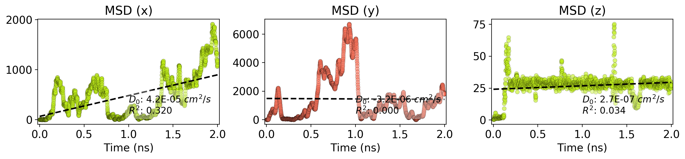
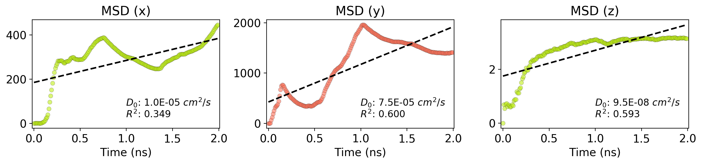

HtBDC_Cu110_2eps_rigid_single
=======

MSD Trajectory
--------------

LAMMPS MSD vs time
------------------

Angstrom MSD vs time
------------------

### Simulation details

-   Simulation directory: /ihome/cwilmer/kbs37/Nanocar/HtBDC_Cu110/UFF/rigid/rigid-only/single
-   Report date: 2018-03-08 17:25

**Lammps Variables**

<table>
  <tr>
    <td>seed</td>
    <td>123456</td>
  </tr>
  <tr>
    <td>dt</td>
    <td>1.0</td>
  </tr>
  <tr>
    <td>T</td>
    <td>200</td>
  </tr>
  <tr>
    <td>txyz</td>
    <td>10000</td>
  </tr>
</table>

#### Simulation files

<table>
  <tr>
    <th>File</th>
    <th>Date</th>
    <th>Size</th>
  </tr>
  <tr>
    <td>job.lammps</td>
    <td>2018-03-07 17:41</td>
    <td>1.0 kB</td>
  </tr>
  <tr>
    <td>traj.xyz</td>
    <td>2018-03-08 17:22</td>
    <td>641.7 kB</td>
  </tr>
  <tr>
    <td>log.lammps</td>
    <td>2018-03-08 17:22</td>
    <td>37.4 kB</td>
  </tr>
  <tr>
    <td>job.lammps~</td>
    <td>2018-03-07 17:39</td>
    <td>1.0 kB</td>
  </tr>
  <tr>
    <td>in.HtBDC_Cu110_UFF</td>
    <td>2018-03-08 16:53</td>
    <td>1.8 kB</td>
  </tr>
  <tr>
    <td>data.HtBDC_Cu110_UFF</td>
    <td>2018-03-07 17:39</td>
    <td>1669.0 kB</td>
  </tr>
  <tr>
    <td>lammps_out.txt</td>
    <td>2018-03-08 17:22</td>
    <td>35.4 kB</td>
  </tr>
  <tr>
    <td>in.HtBDC_Cu110_UFF~</td>
    <td>2018-03-08 16:53</td>
    <td>1.9 kB</td>
  </tr>
  <tr>
    <td>msd1.csv</td>
    <td>2018-03-08 17:22</td>
    <td>185.6 kB</td>
  </tr>
  <tr>
    <td>lammps.out</td>
    <td>2018-03-08 17:25</td>
    <td>19205.8 kB</td>
  </tr>
</table>

